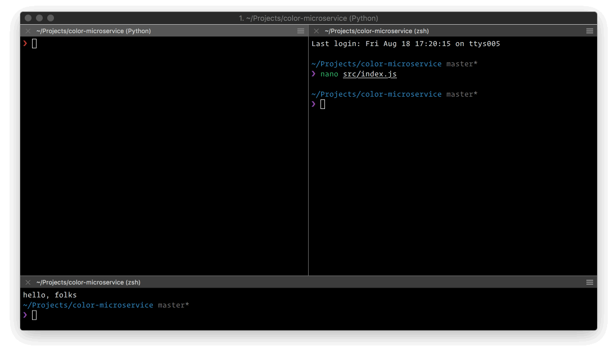

# srv

<p align="center">
  <br>
  
  <br>
</p>


[](https://travis-ci.org/Kikobeats/srv)
[](https://coveralls.io/github/Kikobeats/srv)
[](https://david-dm.org/Kikobeats/srv)
[](https://david-dm.org/Kikobeats/srv#info=devDependencies)
[](https://www.npmjs.org/package/srv)
[](https://paypal.me/Kikobeats)

> HTTP server with Hot Module Replace (HMR) capabilities for development.

This command line interface provide HMR capabilities for a HTTP server.

It's similar [micro-dev](https://github.com/zeit/micro-dev), but for HTTP server out of the box.

## Install

```bash
$ npm install srv --global
```

## Usage

The only require thing is pass to CLI a exported function that follow `app, express` as interface, returning `app` at the end:

```js
const isProduction = process.env.NODE_ENV === 'production'

module.exports = (app, express) => {
  /* here you can do whatever you want */
  app
    .use(require('helmet')())
    .use(require('compression')())
    .use(require('cors')())
    .use(require('jsendp')())
    .use(require('express-status-monitor')())
    .use(bodyParser.urlencoded({ extended: true }))
    .use(bodyParser.json())
    .use(require('morgan')(isProduction ? 'combined' : 'dev'))
    .use(express.static('static'))
    .disable('x-powered-by')

  app.get('/', async function (req, res) {
    return res.send('hello world')
  })

  return app
}
```

Then just call `srv`:

```bash
$ srv

   ┌───────────────────────────────────────────────────┐
   │                                                   │
   │   my-express-api is running!                      │
   │                                                   │
   │   • Local:            http://localhost:3000       │
   │   • On Your Network:  http://192.168.1.106:3000   │
   │                                                   │
   └───────────────────────────────────────────────────┘
```

Here `srv` it assuming the main file is called `index.js` and it exists in the current directory. Otherwise, you can provide the file path as first argument.

Now whatever file modification in the current directory is listened by the `srv` automagically:

```bash
  ┌───────────────────────────────────────────────────┐
  │                                                   │
  │   my-express-api is running!                      │
  │                                                   │
  │   • Local:            http://localhost:3000       │
  │   • On Your Network:  http://192.168.1.106:3000   │
  │                                                   │
  └───────────────────────────────────────────────────┘
  
   ℹ 18:32:42 modified index.js
```

It takes in consideration your `.gitignore` files, so it only reloads the right file.

Using `srv --watch` you can add more files to be watched, but you need to reload the server in any time, just type `rs`:

```bash
  ┌───────────────────────────────────────────────────┐
  │                                                   │
  │   my-express-api is running!                      │
  │                                                   │
  │   • Local:            http://localhost:3000       │
  │   • On Your Network:  http://192.168.1.106:3000   │
  │                                                   │
  └───────────────────────────────────────────────────┘
  
   ℹ 18:32:42 modified index.js
   rs
   ℹ 18:34:07 restart index.js
```

## License

MIT © [Kiko Beats](https://github.com/Kikobeats).
